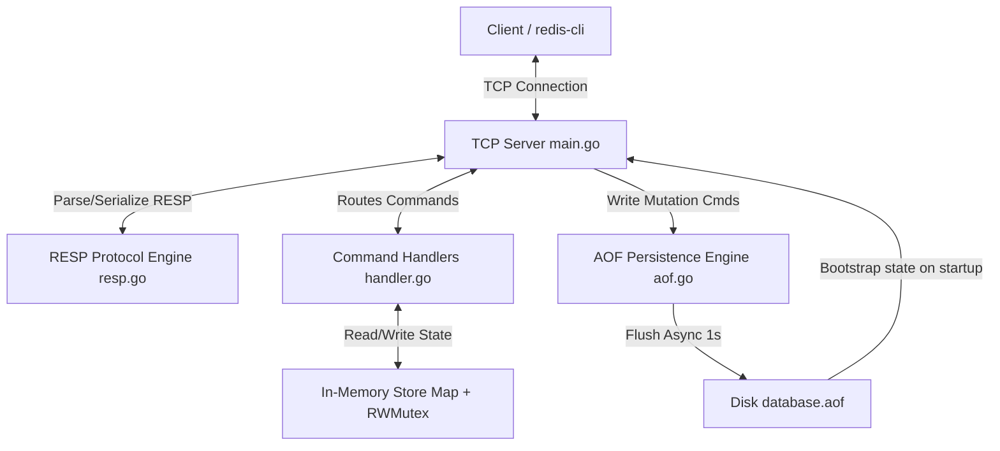

# Build a Redis Clone from Scratch in Go and Java

For full road map: [DOCS/full_feature_roadmap.md](DOCS/full_feature_roadmap.md)

This repository contains a lightweight Redis-compatible clone built entirely from scratch in Go. It implements a TCP socket server, parses and serializes the standard Redis Serialization Protocol (RESP), manages data in thread-safe memory stores (using mutexes), and ensures data durability using an Append-Only File (AOF) persistence engine. Note that while in-memory operations are thread-safe, client concurrency is planned for Phase 2.

## 🚀 Why This Project Matters

Building a database like Redis from scratch is one of the most rewarding exercises for a software engineer. Rather than treating databases as "black boxes," this project dives into the low-level mechanics of:
1. **Network Socket Programming**: Managing long-lived TCP connections, buffered I/O, and reading raw bytes efficiently.
2. **Protocol Parsing**: Writing a custom deserializer and serializer for the Redis RESP format, enforcing correct byte alignment, and processing streaming tokens.
3. **Thread Safety & Memory Access**: Dealing with race conditions in in-memory key-value stores using read-write mutexes (`sync.RWMutex`) to allow concurrent reads while blocking writes.
4. **Data Persistence**: Implementing an Append-Only File (AOF) strategy, writing mutations to disk, running an asynchronous synchronization loop (similar to Redis' `appendfsync everysec`), and bootstrapping database state from a file.

---

## 📖 Discoveries & Learnings

Throughout the development of this project, I have been logging key concepts, new terminology, and "aha!" moments in simple, easy-to-understand terms.

Check out the [DOCS/glossary_of_key_concepts.md](DOCS/glossary_of_key_concepts.md) file to follow along with the concepts learned (e.g., In-Memory Stores, AOF, Mutexes, RESP, and TCP Sockets).

---

## �️ System Architecture



---

## 🧩 Detailed Code Breakdown

Here is how the system is structured and how each file contributes to the overall database engine:

### 1. The TCP Server: [main.go](main.go)
The entry point of the application binds to TCP port `:6379`.
- **Bootstrap Phase**: On start, it initializes the AOF engine. If a `database.aof` file is present, it reads all historical commands sequentialy and replays them into memory to restore state before accepting new connections.
- **Connection Handling**: It accepts incoming client connections. For each connected client, it continuously loops, reading RESP array frames, mapping the command (e.g. `SET`, `GET`) to its respective handler, executing the command, persisting mutations, and writing RESP responses back to the client.

### 2. RESP Deserializer & Serializer: [resp.go](resp.go)
Redis uses the **RESP (Redis Serialization Protocol)** to communicate. It is a human-readable protocol where the first byte determines the type:
- `+` for **Simple Strings**
- `-` for **Errors**
- `:` for **Integers**
- `$` for **Bulk Strings**
- `*` for **Arrays**

`resp.go` implements:
- `Resp` struct wrapping a `bufio.Reader` for fast byte-level reading.
- Deserialization methods like `readArray()` and `readBulk()` to parse incoming client commands into a structured `Value` node.
- Serialization methods (`Value.Marshal()`) to convert Go datatypes back into RESP binary streams (e.g., marshaling arrays or bulk strings to return to `redis-cli`).

### 3. Thread-Safe Command Handlers: [handler.go](handler.go)
Our in-memory store uses Go `map[string]string` for simple key-values (`SET`/`GET`) and `map[string]map[string]string` for hash tables (`HSET`/`HGET`/`HGETALL`).
- Go maps are **not thread-safe**. If multiple clients read/write concurrently, the runtime will panic.
- To prevent this, we guard the stores with a `sync.RWMutex`.
- We use R-Locks (`RLock()`) for read operations (`GET`, `HGET`, `HGETALL`) to allow concurrent reads, and write locks (`Lock()`) for write operations (`SET`, `HSET`) to block access until the write completes safely.

### 4. AOF Persistence Engine: [aof.go](aof.go)
Without persistence, database state is lost when the server stops.
- `aof.go` opens an append-only transaction log file (`database.aof`).
- Every time a mutating command (`SET` or `HSET`) is executed, the raw RESP array payload is written to the file.
- **Asynchronous Sync**: Writing to physical disk storage is expensive and slow. To keep performance high while ensuring durability, we start a background goroutine that calls `file.Sync()` every second. This guarantees that at most 1 second of transactions can be lost in the event of a power failure.

### 5. Redis Pipelining Support
Redis pipelining allows clients to send multiple commands down the TCP socket stream back-to-back without waiting for individual replies, then read all responses at once to bypass network round-trip latency.
- To natively support pipelining without dropping or corrupting data, the client's `Resp` reader and writer are instantiated **outside** the socket's read/write loop in `main.go`.
- This ensures Go's buffered reader (`bufio.Reader`) preserves any lookahead bytes from subsequent pipelined commands rather than discarding them when instantiating new connection objects.

---

## 🏃 How to Setup and Run

### Prerequisites
Before running or modifying this codebase, make sure you have:
1. **Go (v1.18 or higher)** installed on your machine.
2. **Docker** installed to run the Redis CLI client for testing.

### Step 1: Clone and Run the Go Server
1. Clone the project and navigate to the project directory.
2. Start the server on port `:6379`:
   ```bash
   go run .
   ```
   *Note: If port `6379` is occupied (e.g., by a local Redis service), stop that service first.*

### Step 2: Test Using the Redis CLI Client
Use a Docker container running `redis:alpine` to run `redis-cli` against your Go server:

**For local run (`go run .`):**
```powershell
docker run -it --rm redis:alpine redis-cli -h host.docker.internal -p 6379
```

**For Docker Compose run (`docker compose up -d`):**
```powershell
docker run -it --rm redis:alpine redis-cli -h host.docker.internal -p 6390
```

Once connected, run commands:
```text
127.0.0.1:6379> PING
"PONG"

127.0.0.1:6379> SET user:1 "Chamod"
"OK"

127.0.0.1:6379> GET user:1
"Chamod"

127.0.0.1:6379> HSET user:1:details age 25 city Colombo
"OK"

127.0.0.1:6379> HGETALL user:1:details
1) "age"
2) "25"
3) "city"
4) "Colombo"
```

### Step 3: Test AOF Persistence
1. With the Go server running, set a key: `SET database "Go Redis"`.
2. Stop the Go server (Ctrl+C).
3. Inspect the `database.aof` file. You will see the commands logged in RESP format.
4. Start the Go server again: `go run .`.
5. Run the client and query `GET database`. You should receive `"Go Redis"`, proving that the database reloaded its state successfully from disk!

---

## 💡 What You Should Know Before Attempting This

If someone wants to build a similar project, they must possess or learn:
- **Go Concurrency primitives**: Understanding goroutines, channel mechanics, and why `sync.Mutex` vs `sync.RWMutex` are used to prevent data races.
- **The RESP protocol format**: Familiarity with how data types are structured, especially bulk strings and array elements terminated by `\r\n`.
- **Basic Networking concepts**: Knowledge of how TCP connections work, handling `io.EOF` when a client disconnects, and why buffered IO (`bufio`) is used to read bytes.
- **I/O Operations**: Understanding read/write buffers, file seeking, and the difference between buffered file writes and forced physical disk flushing (`fsync`).