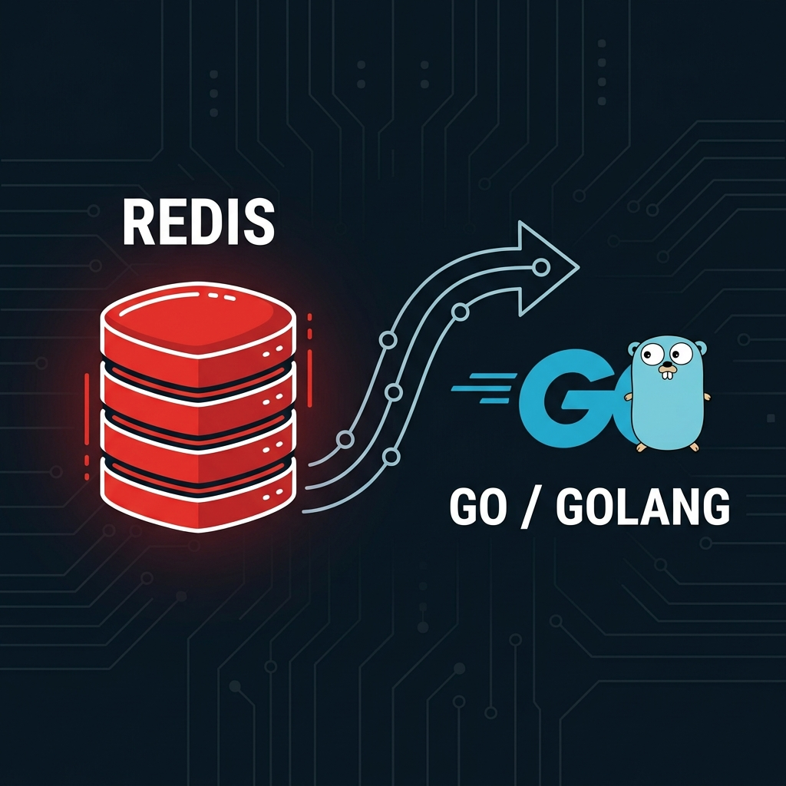

# Don’t Let Your Employer Lead Your Career: Why You Should Reinvent the Wheel

As software engineers, we hear this mantra constantly: *"Use existing libraries." "Don't write what's already been written."* 

For production applications? Absolutely. 

But for **your growth as an engineer**? It’s some of the worst advice you can follow.

One of the best pieces of career advice I ever heard comes from "Uncle Bob" Martin: 
> *"Don't let your employer lead you in your career; lead your employer. Take the time to understand things. It may not immediately get you a better job, but it will open more doors the longer you stick with it."*

The fastest way to bridge the gap between a junior developer and a senior systems thinker isn't by gluing API endpoints together. It’s by rebuilding the systems we take for granted. 

As Richard Feynman famously wrote on his blackboard:
> *"What I cannot create, I do not understand."*

Want to truly master backend engineering? 
* **Roll your own HTTP server.** You will learn more about TCP/IP and HTTP headers in a weekend than in years of using Express, Spring, or FastAPI.
* **Try rebuilding Git.** Linus Torvalds did it in 5 days. See how far you can get.
* **Build a database from scratch.** Demystify the "black box" where your data lives.

That is exactly why I decided to build my own **concurrent, in-memory database inspired by Redis from scratch in Go.**

---

### 🔍 Inside the Project: Building a Redis Clone

For a long time, databases like Redis felt like magic. You run `SET` and `GET`, and data instantly appears. 

To understand what happens behind the scenes, I built a Go-based server that speaks the native **Redis Serialization Protocol (RESP)**. Because it uses RESP, **any standard Redis client can connect to and query it.**

Here is the architecture of what I built:

1. **TCP Socket Server:** Built a raw TCP listener in Go to handle concurrent, multiplexed, and long-lived client connections.
2. **RESP Engine:** Wrote a custom serializer and deserializer to parse commands (like `*3\r\n$3\r\nSET\r\n...`) and format replies byte-by-byte.
3. **Thread-Safe State Handlers:** Implemented in-memory key-value and nested hash stores using Go maps, guarded by `sync.RWMutex` to prevent data corruption during concurrent operations.
4. **Append-Only File (AOF) Persistence:** Added a transaction logger that writes write-mutations to disk (`database.aof`) and uses a background goroutine to flush changes every second (matching Redis's `appendfsync everysec` behavior).
5. **Pipelining:** Optimized client throughput by parsing continuous streams directly out of reusable connection buffers.

---

### 💡 Key Takeaways for Systems Thinking

Building this didn't just teach me how Redis works; it forced me to wrestle with fundamental systems engineering trade-offs:

* **Protocol & Stream Design:** Parsing binary and text streams efficiently using buffered I/O (`bufio.Reader` and `bufio.Writer`).
* **Concurrency Control:** Fine-grained locking strategies to maximize read throughput while ensuring write safety under high concurrent loads.
* **Durability vs. Performance:** Navigating the friction between disk speed (`fsync`) and memory speed, and how asynchronous flushing prevents write bottlenecks.

Building a database from scratch isn't about replacing Redis or writing production database engines. It's about training your brain to think about latency, memory layout, system boundaries, and concurrency. It turns you from a consumer of framework APIs into a systems builder.

Do you want to level up your engineering skills? Stop looking for the next framework tutorial. Pick a tool you use every day, open a blank editor, and try to build a basic version of it.

If you’re interested in systems programming or building things from scratch, let's connect! 

Check out the full breakdown and codebase in my repository: [Link to Github/README] 📁

#Golang #SystemDesign #BackendEngineering #Redis #Concurrency #SoftwareEngineering #Databases #BuildInPublic
